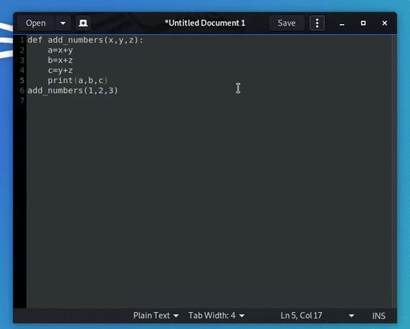
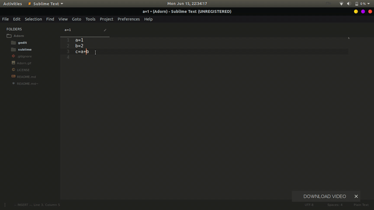

  

        A one click support of black code formatter for IDEs and text editors.

### Requirements

* You must have any of the following text editor
   * [Gedit](https://wiki.gnome.org/Apps/Gedit)
   * Sublime Text 3

### Demo

* Gedit Demo

     

* Sublime Demo
       
     
        

### General Info
 * currently there is support for gedit and sublime text only
 * Tested for root user only so A permission error may arise if used by another user(And these are visible only  though console).
 * For now run gedit or sublim with sudo only ``sudo gedit filename``
 
### Using
Sublim Text 3
 * steps
   * Select the snippet you want to format 
   * Right click on the window and then click on Adorn 

### Install

* find install.sh file inside the folder gedit/sublime 
* Open terminal and execute `sudo ./install.sh`
  

### Contributing

Pull requests are welcome. For major changes, please open an issue first
to discuss what you would like to change.
